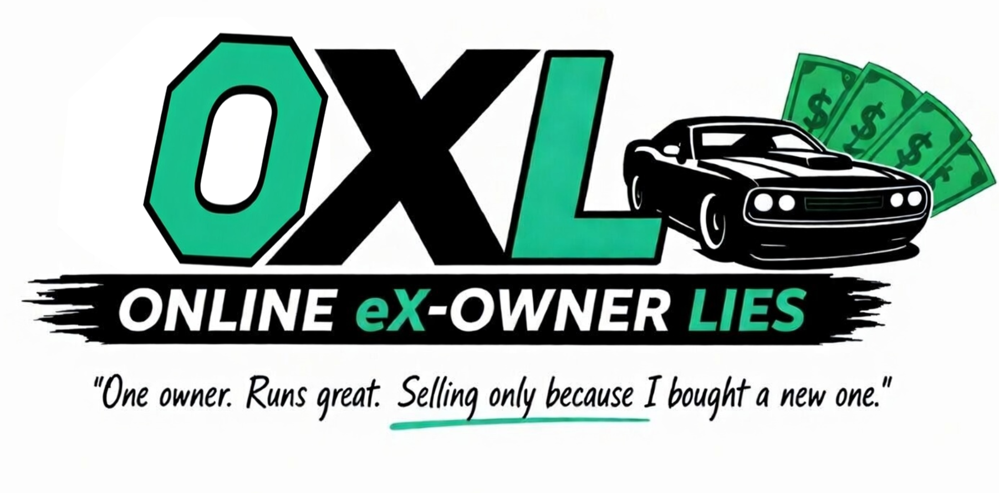

  ⚠️ WORK IN PROGRESS ⚠️

  

# OXL — Online eX-Owner Lies 🚗💸

> *"One owner. Runs great. Selling only because I bought a new one."*

**OXL** is an in-game car auction website mod for **Car Mechanic Simulator 2026**.
Browse listings, spot a deal, buy a wreck — then fix it up and sell it for profit.

"Controls\n  Home  —  toggle the OXL panel\n  oxl_open  —  console command\n\n" +

## ✨ Features

- **Live Listings** — 4 to 10 active auctions at any time, refreshed dynamically as
  in-game time passes. Miss the window and the deal is gone.
- **Filters** — narrow down by make and year
- **Seller Descriptions** — every listing comes with a suspiciously optimistic write-up
  from the previous owner
- **One-click Purchase** — car spawns in your parking lot, cash is deducted instantly

---

## 📥 Installation

**Required:**
- [MelonLoader v0.7.2+](https://github.com/LavaGang/MelonLoader)
- [_CMS2026_UITK_Framework](link)

**Optional:**
- [CMS 2026 Simple Console](link) — enables the `oxl_open` command

**Steps:**
1. Drop `_CMS2026_UITK_Framework.dll` into your `Mods/` folder
2. Drop `OXL.dll` into your `Mods/` folder
3. Launch the game

---

## 🚀 Usage

| Action | How |
|---|---|
| Open / close panel | **HOME** |
| Filter listings | Dropdowns at the top of the panel |
| Buy a car | *Buy* button on any listing |
| Console command | `oxl_open` *(requires Simple Console)* |

---

## 🗺️ Roadmap

### ✅ Done
- [x] Browse and search listings with filters
- [x] Purchase a car — spawns on parking lot, deducts cash
- [x] Dynamic auctions with time limits

### 🔧 In Progress / Planned — Core
- [] Randomised seller descriptions
- [ ] Delivery delay system — cars arrive after a set time, not instantly
- [ ] Randomised vehicle damage — cars spawn with realistic wear and faults
- [ ] Full listing detail page — registration, color, real specs (currently placeholder)
- [ ] Seller personalities and backstories
- [ ] Scam listings — learn to spot fraud from descriptions and seller profiles

### 🔧 Planned — Content
- [ ] Used parts listings
- [ ] Workshop tools and decoration items listings
- [ ] Expanded vehicle photo library — more cars, more authentic listings

### 🔧 Planned — Seller Interaction
- [ ] Chat window with seller — avatars, dialogue UI
- [ ] Dialogue options — probe the seller, negotiate price
- [ ] Price negotiation system

### 🔧 Planned — Player Side
- [ ] List your own cars, parts, and tools for sale through OXL
- [ ] Seller profile for the player

### ⚙️ Planned — Settings
- [ ] Options panel — customise listing generation, economy, delivery times

### 🔮 Future
- [ ] *Part of something bigger — details coming later*

---

## ⚠️ Known Limitations

- Panel renders below the native Canvas during scene transitions (Unity architecture)
- Demo car limit is capped at 10 — purchase is blocked when the lot is full

---

## 📄 License

© Blaster — [CC BY-NC-ND 4.0](https://creativecommons.org/licenses/by-nc-nd/4.0/)
Free to use. No modifications. No redistribution without permission.

---

*Built on [CMS2026 UITK Framework](link) — the community UI library for CMS 2026 mods.*